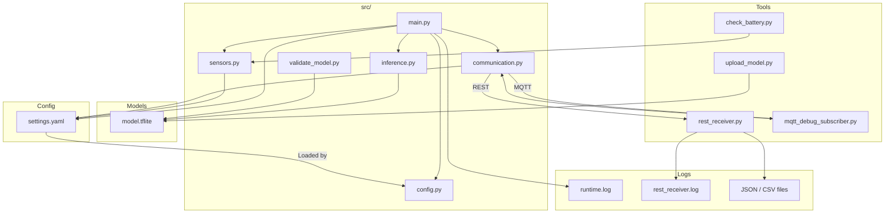

# Raspberry Pi–based Edge AI Solution

This project implements a modular, container-friendly AI edge node architecture, designed to run on a Raspberry Pi using lightweight, high-performance models for local inferencing and actuation. The solution is based on the AI-REDGIO 5.0 Open Hardware Platform developed by HOPU.

## Overview

The solution enables real-time AI inference and decision-making directly on edge devices, using the following components:

- **AI Inference Engine** (TFLite/ONNX)
- **Sensor Input Abstraction** (camera, temperature, simulated or physical sensors)
- **Edge Communication Layer** (MQTT/REST)
- **Local Logging and Persistence**
- **Modular Docker-based deployment**

---

## Project Structure

```
rpi_edge_ai/
├── config/                    # YAML configuration files
│   └── settings.yaml          # Main config for sensors, model, comms
├── models/                    # AI models
│   └── model.tflite           # Default pretrained MobileNet model
├── logs/                      # Runtime logging and result persistence
│   ├── runtime.log            # Logs from the edge_node container
│   └── rest_data/             # REST receiver logs and collected results
│       ├── rest_receiver.log  # Raw logs from REST API
│       └── *.json / *.csv     # Structured payloads and summaries
├── src/                       # Main Python source files
│   ├── main.py                # Main orchestrator
│   ├── inference.py           # Inference engine wrapper
│   ├── sensors.py             # Sensor input abstraction (camera/temp/etc.)
│   ├── communication.py       # MQTT and REST publisher
│   ├── config.py              # YAML config loader
│   └── validate_model.py      # Verifies model format and input shape
├── tools/                     # Development/debugging tools
│   ├── rest_api/              # REST receiver container
│   │   ├── Dockerfile.rest
│   │   └── rest_receiver.py
│   ├── mqtt_debug_subscriber.py  # Standalone MQTT monitor
│   ├── check_battery.py         # Local battery status checker
│   └── upload_model.py          # Upload new model via REST
├── Dockerfile                 # Edge node Dockerfile (main service)
├── docker-compose.yml         # Multi-container deployment
├── requirements.txt           # Python dependencies
├── Makefile                   # Docker helper commands
├── bootstrap_env.sh           # Optional venv bootstrap (non-Docker)
└── README.md                  # Documentation
```

### Architecture Diagram



---

## Quickstart

### 1. Clone the repository

```bash
git clone https://github.com/AI-REDGIO-5-0/AI-REDGIO-5.0-T5.2-RaspberryPi-Deployment-Guide.git
cd AI-REDGIO-5.0-T5.2-RaspberryPi-Deployment-Guide
```

### 2. Build and launch the full system (Docker recommended)

```bash
make up
```

This will:
- Start the MQTT broker (Eclipse Mosquitto)
- Start the REST receiver (Flask)
- Start the Edge AI node with camera + AI inference + communication

### 3. View logs

```bash
make logs           # Logs from main AI node
make logs-rest      # Logs from REST receiver
make logs-mqtt      # Logs from MQTT broker
```

---

## Configuration

All parameters are managed via `config/settings.yaml`. Example:

```yaml
sensors:
  camera_enabled: true
  read_interval: 5
  temperature_enabled: true
  temperature_simulated: true

communication:
  mqtt:
    enabled: true
    broker: mqtt
    port: 1883
    topic: rpi/ai/results/pedro

  rest:
    enabled: true
    endpoint: http://rest_api:5000/api/results
```

---

## AI Model – `model.tflite`

The file `models/model.tflite` is a lightweight, pre-trained TensorFlow Lite model used for performing inference directly on edge devices. This default model is based on **MobileNetV1 (quantized)**, a highly efficient convolutional neural network trained on **ImageNet** for general-purpose image classification.

- **Input shape**: `[1, 224, 224, 3]` (RGB image)
- **Output**: Class prediction probabilities across 1001 categories
- **Use case**: Demonstrates how to process real-time image frames using an edge-optimized classifier

This model is ideal for testing performance and integration of the AI pipeline, but you can replace it with your own model.

### Replacing with Your Own Model

You can swap the default model with a custom one (trained or downloaded). Here's how:

1. **Train a model** using TensorFlow, PyTorch, or Keras.
2. **Convert the model** to `.tflite` using the TFLite Converter:

```python
# Example (TensorFlow/Keras)
import tensorflow as tf
converter = tf.lite.TFLiteConverter.from_saved_model('your_model_path')
tflite_model = converter.convert()
with open('model.tflite', 'wb') as f:
    f.write(tflite_model)
```

3. **Place your model** in `models/model.tflite`
4. **Update the `input_shape`** in `settings.yaml` if different:

```yaml
model:
  input_shape: [1, 224, 224, 3]  # Adjust to match your model
```

5. **Run `validate_model.py`** to ensure compatibility:

```bash
python src/validate_model.py
```

### Replacing the Model via REST API

You can replace the current model by uploading a new `.tflite` file through the REST API. Only one model is kept at a time to reduce memory/storage usage.

#### Upload a new model (manual)

```bash
curl -X POST http://localhost:5000/api/model/upload \
  -F "file=@/path/to/your/model.tflite"
```

This will overwrite the existing `models/model.tflite` file.

#### Upload using helper script

```bash
python tools/upload_model.py
```
This will send the model located at `models/model.tflite` to the running REST container.

#### Check current model info

```bash
curl http://localhost:5000/api/model/info
```

Returns:
```json
{
  "status": "ok",
  "model": {
    "filename": "model.tflite",
    "size_bytes": 917328,
    "last_modified": "2025-04-15T10:45:23"
  }
}
```

---

## Logs and Monitoring

All relevant events, inference results, and sensor readings are logged:

- **`logs/runtime.log`**: Generated by the main AI system, includes all inferences and sensor values.
- **`logs/rest_data/rest_receiver.log`**: Captures incoming REST POST requests and payloads.
- **`.json/.csv files`** in `rest_data/`: Structured logs for downstream processing or analytics.

You can monitor these logs using:

```bash
tail -f logs/runtime.log
less logs/rest_data/rest_receiver.log
```

---

## REST API Endpoints

The REST receiver supports the following endpoints:

### `POST /api/results`
Receives AI inference results and sensor readings.

**Payload example:**
```json
{
  "result": [[23, 45, 66, 89]],
  "temperature": 26.7
}
```

Logs the data to:
- `logs/rest_data/rest_receiver.log`
- Individual `.json` files per reading
- Appends to `data_log.csv`

---

### `GET /api/battery`
Returns the battery level if available, or a message indicating external power.

**Example responses:**
```json
{
  "status": "ok",
  "battery_level": 74,
  "message": "Battery level retrieved successfully."
}
```

```json
{
  "status": "unavailable",
  "battery_level": null,
  "message": "No battery detected. System likely running on external power."
}
```

### `GET /api/model/info`
Returns filename, size and timestamp of the current model.

### `POST /api/model/upload`
Allows uploading a new `.tflite` model to replace the current one. This is the preferred way to update models remotely.

---

## Installation on Raspberry Pi

To run this solution directly on a Raspberry Pi (preferably a Pi 4 with 4GB or more):

1. **Flash Raspberry Pi OS 64-bit (Lite or Desktop)**
2. Enable camera module and I2C (if needed) using:

```bash
sudo raspi-config
```

3. **Clone and enter project**

```bash
git clone https://github.com/AI-REDGIO-5-0/AI-REDGIO-5.0-T5.2-RaspberryPi-Deployment-Guide.git
cd AI-REDGIO-5.0-T5.2-RaspberryPi-Deployment-Guide
```

4. **Create virtual environment (recommended)**

```bash
sudo apt install python3.10-venv python3.10 python3-pip -y
./bootstrap_env.sh
source .venv/bin/activate
```

> The script `bootstrap_env.sh` will automatically:
> - Create a clean Python 3.10 virtual environment
> - Install all dependencies listed in `requirements.txt`

5. **Run your application**

```bash
python src/main.py
```

> If you're using Docker on Raspberry Pi, make sure your user is in the `docker` group:
> `sudo usermod -aG docker $USER` and restart the device.

---

## Development Commands

```bash
make up           # Build and run all services
make logs         # Logs from main edge node
make down         # Stop all containers
make clean        # Remove all containers and volumes
make restart      # Restart only edge_node
```

If `make` is not available on your system, you can run the equivalent Docker commands manually:

### Command Equivalents (Without `make`)

| `make` Command     | Equivalent `docker compose` Command                         | Description                                |
|--------------------|-------------------------------------------------------------|--------------------------------------------|
| `make up`          | `docker compose up --build`                                 | Build and launch all containers            |
| `make down`        | `docker compose down`                                       | Stop and remove all containers             |
| `make clean`       | `docker compose down -v`                                    | Stop and delete volumes too (destructive)  |
| `make logs`        | `docker compose logs -f edge_node`                          | Show live logs from the main AI container  |
| `make logs-rest`   | `docker compose logs -f rest_api`                           | Show logs from the REST receiver           |
| `make logs-mqtt`   | `docker compose logs -f mqtt`                               | Show logs from the MQTT broker             |
| `make logs-all`    | `docker compose logs -f`                                    | Tail logs from all containers              |
| `make restart`     | `docker compose restart edge_node`                          | Restart the main inference node            |
| `make rebuild`     | `docker compose down -v && docker compose up --build`       | Full rebuild and relaunch                  |

> These are exactly the same commands that the `Makefile` automates. You can run them manually in the terminal if `make` is not available.

---

## License

MIT License – Feel free to use, modify, and contribute.

---

## Acknowledgment

This work is performed within the AI REDGIO 5.0 project:

"Regions and (E)DIHs alliance for AI-at-the-Edge adoption by European Industry 5.0 Manufacturing SMEs" under EU Grant Agreement No. 101092069.